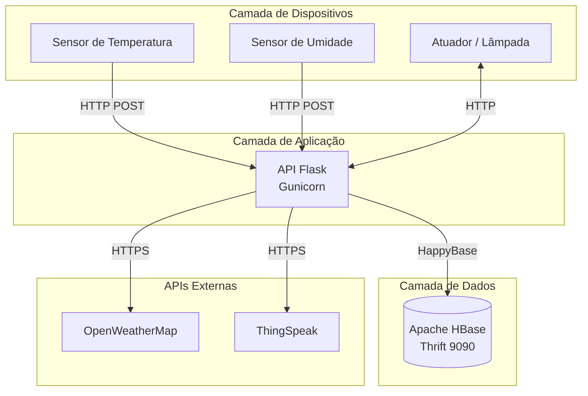
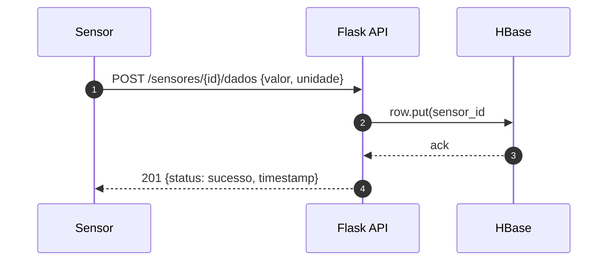
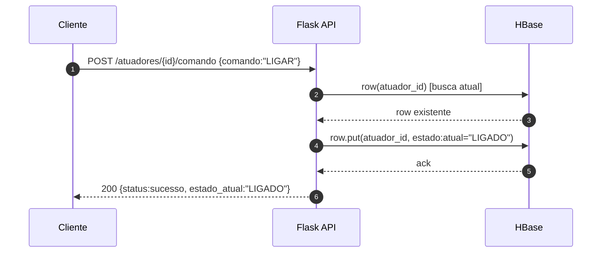
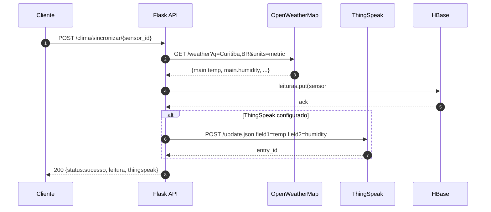
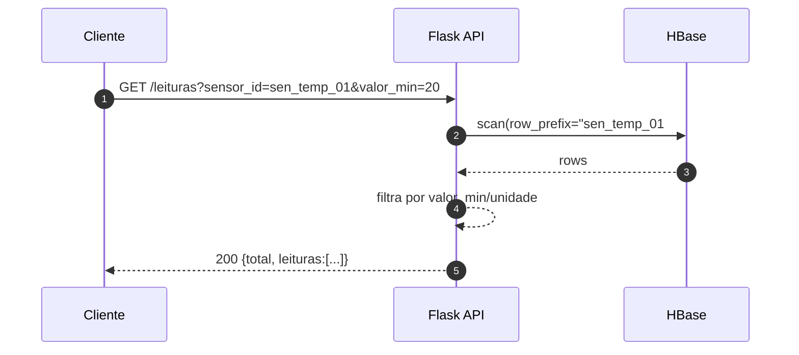

# Diagramas de Arquitetura e Sequência

## Arquitetura geral

## Sequência — envio de leitura por um sensor

## Sequência — comando para atuador

## Sequência — integração com webservice externo

## Sequência — busca filtrada de leituras

