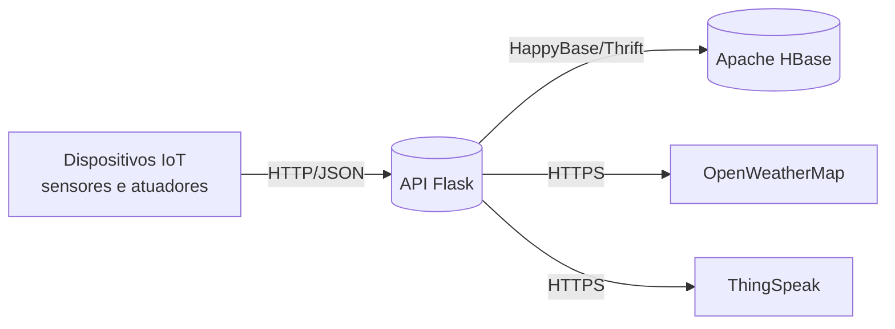

# Detalhamento do Contexto — Sistema de Gerência de Sensores IoT

> Documento de entrega da **Semana 1** do Trabalho de Webservices.

## 1. Visão geral

A aplicação consiste em uma **API REST** para gerenciamento de dispositivos
IoT — sensores e atuadores — capaz de registrar dispositivos, receber
leituras, executar comandos e oferecer consultas em tempo real. O sistema
foi projetado para um cenário com alto volume de inserções, característico
de aplicações IoT.

A arquitetura é **cliente-servidor**: os dispositivos (ou simuladores)
atuam como clientes, comunicando-se com um servidor central que centraliza
armazenamento e disponibilização das informações. Toda a comunicação
externa ocorre sobre **HTTP**, em estilo **REST**, com payloads em
**JSON**.

## 2. Pilha tecnológica

| Camada                | Tecnologia escolhida                        | Por quê |
|-----------------------|---------------------------------------------|---------|
| Linguagem             | Python 3.11                                 | produtividade, ecossistema de IoT |
| Framework Web         | Flask 3                                     | leve, idiomático para APIs REST |
| Servidor WSGI         | Gunicorn                                    | produção, multi-worker |
| Banco de dados        | Apache HBase (standalone)                   | NoSQL colunar, alta taxa de escrita |
| Cliente HBase         | HappyBase (Thrift, porta 9090)              | API Pythonic para HBase |
| Containerização       | Docker / Docker Compose                     | portabilidade do banco e do serviço |
| API externa #1        | OpenWeatherMap                              | enriquecimento ambiental |
| API externa #2        | ThingSpeak                                  | envio para plataforma IoT em nuvem |
| Testes                | Pytest                                      | smoke tests da API |
| Versionamento         | Git                                         | controle de versão |
| IDE                   | Visual Studio Code                          | suporte a Python, Docker, REST Client |
| Teste de API          | Postman / curl                              | validação manual e collection |

## 3. Padrão arquitetural

- **REST + JSON** sobre **HTTP** — métodos `GET`, `POST`, `PUT`, `DELETE`.
- **HBase**: tabelas com famílias de colunas, escolhidas para sustentar
  alto throughput de escrita típico de IoT.
- **APIs de terceiros** consumidas via cliente HTTP `requests`.

## 4. Modelagem do HBase

| Tabela            | Row key                            | Famílias / Colunas | Propósito |
|-------------------|------------------------------------|--------------------|-----------|
| `iot_sensores`    | `sen_<uuid>`                       | `info:tipo`, `info:localizacao`, `info:descricao`, `info:criado_em` | Cadastro de sensores |
| `iot_atuadores`   | `atu_<uuid>`                       | `info:nome`, `info:tipo`, `info:localizacao`, `estado:atual`, `estado:atualizado_em` | Cadastro e estado dos atuadores |
| `iot_leituras`    | `<sensor_id>#<reverse_timestamp>`  | `dados:sensor_id`, `dados:valor`, `dados:unidade`, `dados:timestamp` | Histórico de leituras |

O **timestamp invertido** (`10^13 - ts`) compõe a row key das leituras,
de modo que um `scan` por `row_prefix=<sensor_id>#` devolva as leituras
mais recentes primeiro — característica útil em dashboards de
monitoramento.

## 5. Mapa de endpoints

| Requisito | Endpoint | Verbos |
|-----------|----------|--------|
| Cadastro de sensor              | `/sensores`                       | POST, GET (lista) |
| Busca por chave (Req. 3)        | `/sensores/<id>`                  | GET, PUT, DELETE |
| Envio de leitura                | `/sensores/<id>/dados`            | POST, GET |
| Lista filtrada (Req. 5)         | `/sensores?tipo=...&localizacao=...`, `/leituras?sensor_id=...&valor_min=...` | GET |
| Comando p/ atuador (Req. 2)     | `/atuadores/<id>/comando`         | POST → `status: sucesso\|falha` |
| API externa (Req. 4)            | `/clima?cidade=Curitiba,BR`       | GET |
| Sincronização externa→HBase     | `/clima/sincronizar/<sensor_id>`  | POST |

## 6. Rede e protocolo

- **Transporte:** TCP/IP
- **Aplicação:** HTTP/1.1 (TLS em produção via reverse proxy do Render/Railway)
- **Estilo:** REST stateless
- **Conteúdo:** `application/json` (UTF-8)
- **Códigos relevantes:** `200`, `201`, `400`, `404`, `500`, `502`

## 7. Ferramentas de apoio

- **VS Code** + extensões Python e Docker
- **Postman** para coleção de testes (ver `docs/postman_collection.json`)
- **Docker Desktop** para subir HBase localmente
- **Git/GitHub** para versionamento e CI

## 8. Diagramas

Ver [ARQUITETURA.md](ARQUITETURA.md) para os diagramas de arquitetura e
sequência completos (Mermaid).

## 9. Implantação

A aplicação é distribuída como imagem Docker. O `docker-compose.yml`
sobe HBase + API. Para deploy público está pronto um Blueprint para
**Render.com** ([render.yaml](../render.yaml)) e um `Procfile` para
Heroku/Railway.
